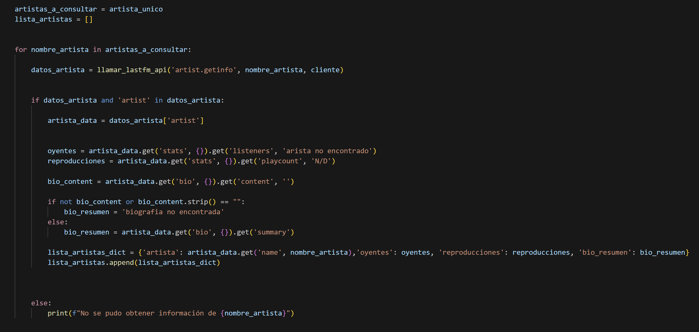
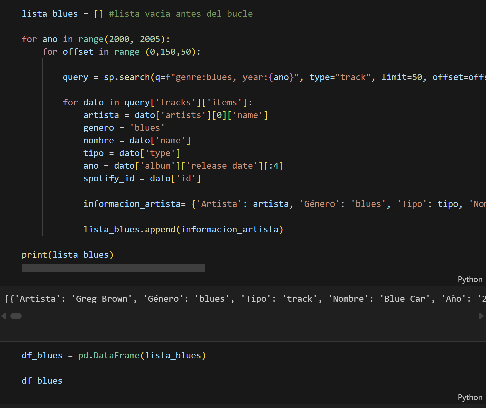
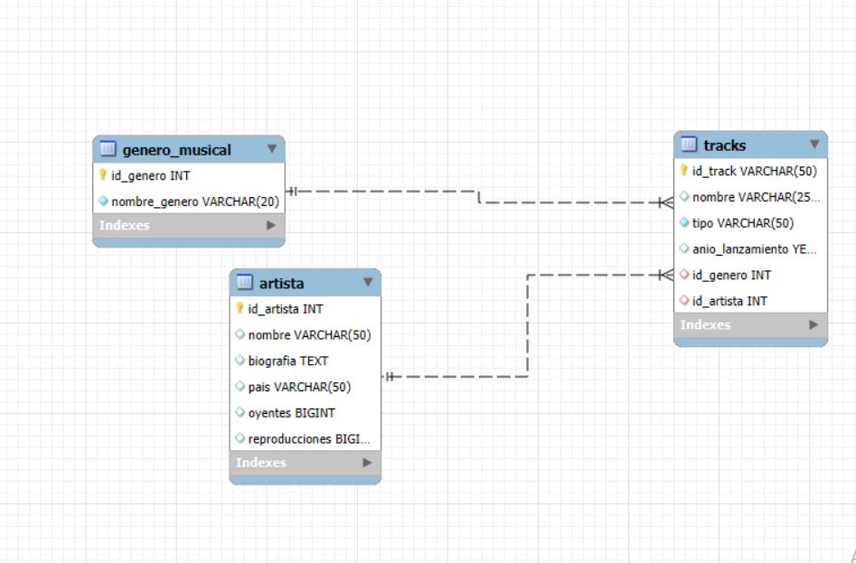
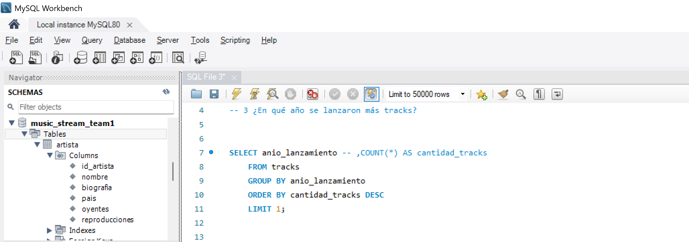

# 🎵 Proyecto: Análisis de Popularidad de Canciones en la Era Digital

## 📁 Repositorio  
**-da-project-promo-60-modulo-2-team-1**

---

## 🎯 Descripción del Proyecto  

**MusicStream**, una plataforma de streaming musical, busca comprender mejor las tendencias musicales y optimizar la experiencia de sus usuarios.  
Este proyecto tiene como objetivo **analizar la popularidad de canciones lanzadas entre los años 2000 y 2005**, utilizando información obtenida de la **API de Spotify** y **Last.fm**.  

El análisis se basa en criterios como:  
- Calificaciones de los usuarios  
- Número de reproducciones  
- Valoraciones  
- Año de lanzamiento  
- Género musical y país de origen del artista  

---

## 💡 Objetivo  

Identificar las **canciones y artistas más populares entre 2000 y 2005** mediante la extracción, organización y análisis de datos.  
La información se almacenará en una base de datos SQL para realizar consultas y obtener conclusiones relevantes sobre las tendencias musicales del periodo.

---

## 🧩 Fases del Proyecto  

### 🔹 Fase 1: Extracción de Datos  
Obtención de información sobre canciones y artistas desde la **API de Spotify** y **Last.fm**.

### 🔹 Fase 2: Organización y Almacenamiento  
Estructuración y almacenamiento de los datos en una base de datos relacional, utilizando **SQL** para su gestión.

Estructura de la Base de Datos 

### 🔹 Fase 3: Análisis y Consultas  
Realización de consultas y análisis para responder a preguntas como:  

- 🎤 ¿Cuál es el artista con más canciones entre 2000 y 2005?  
- 🎧 ¿Qué género musical tiene la mejor valoración?  
- 📅 ¿En qué año se lanzaron más canciones?  
- ⭐ ¿Cuál es la canción mejor valorada?  
- 🏆 ¿Qué artista tiene la valoración promedio más alta?  
- 🌍 ¿Qué país cuenta con más artistas?  
- ⏳ ¿Qué artista ha estado activo más tiempo y cuántas canciones tiene?  

---

## 🧠 Tecnologías y Herramientas  

| Categoría | Herramientas |
|------------|--------------|
| Lenguaje de programación | Python |
| Bases de datos | SQL |
| APIs utilizadas | Spotify, Last.fm |
| Control de versiones | GitHub |
| Metodología de trabajo | Scrum (Agile) |

---

## 👩‍💻 Equipo  

Proyecto desarrollado por estudiantes del **Bootcamp de Análisis de Datos de Adalab**, como parte del **Módulo 2**.  
El objetivo es consolidar los conocimientos adquiridos en **Python**, **SQL** y el **trabajo colaborativo** mediante el uso de **Git y GitHub**.  

---

## 🚀 Resultados Esperados  

- Comprender las tendencias musicales del periodo **2000–2005**.  
- Identificar las canciones y artistas más exitosos de esos años.  
- Desarrollar un proceso completo de análisis de datos: **desde la extracción hasta la interpretación de resultados**.  
